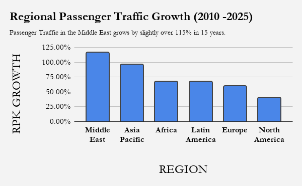
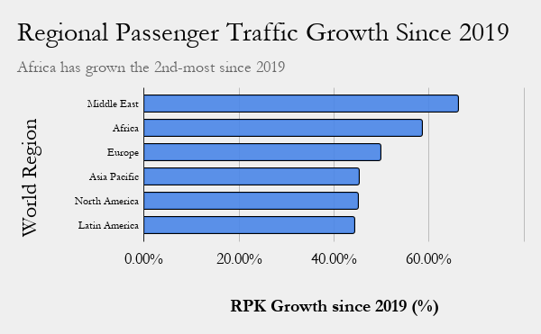
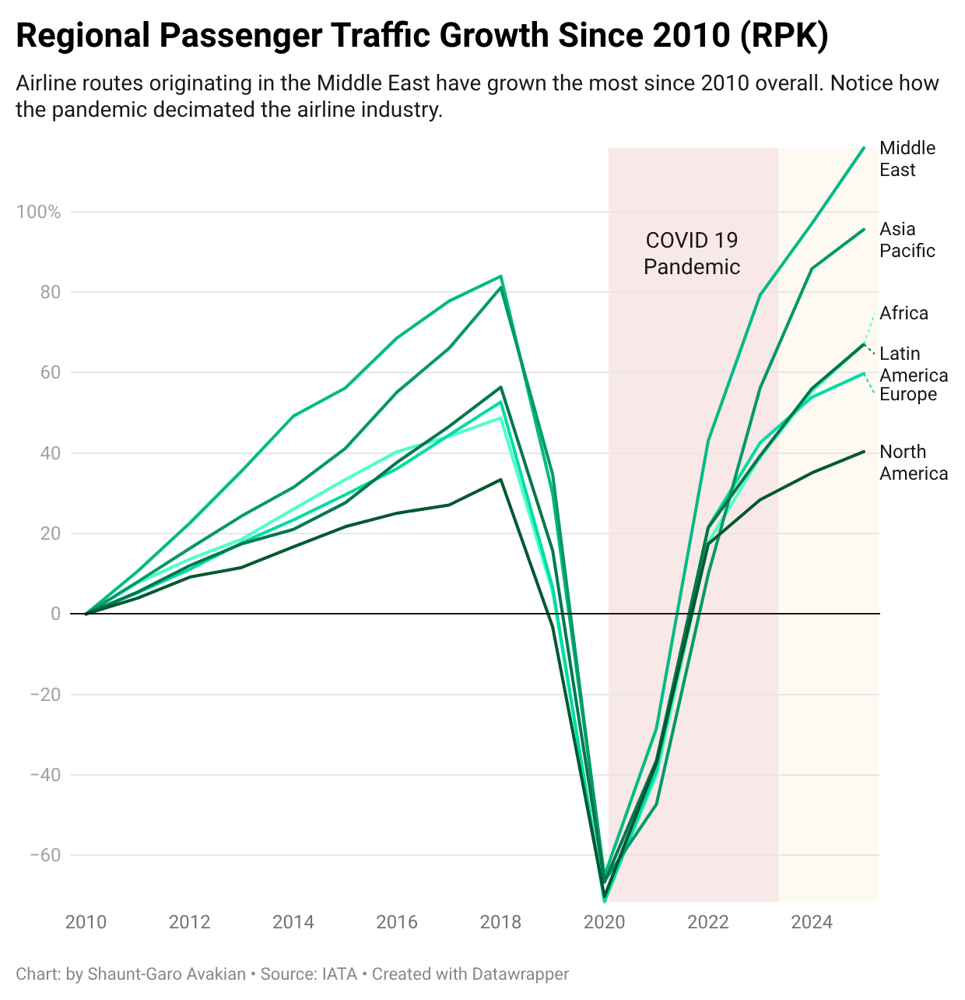
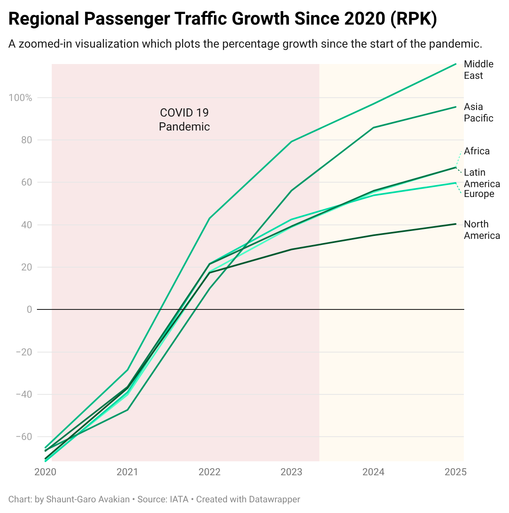

# JOURN124-Final-Project
Creating a journalism story with data for the final project. This one covers Airline Passenger traffic by global region since 2010.
# The Middle East Has Outpaced Everyone In Air Travel for Two Decades and Counting
## Abstract
2020 saw air travel come to a near-halt. Within months, every global region lost roughly three-quarters of all commercial air traffic. Five years removed from the pandemic's onset, the universal collapse of the airline industry has produced fundamentally different patterns of recovery and growth compared to the 2010s. This data analysis of fifteen years of commerical air travel passenger metrics reveals that the Middle Eastern commercial aviation market has not only recovered, but grown larger than pre-COVID numbers.

The race for second place proves equally interesting. For almost the entirety of the 2010s, Asia firmly proved to hold the race's silver medal. But since 2019 specifically, Africa has overtaken it. Growth, therefore, continues to be a metric defined by who's still climbing as opposed to who started the race as the biggest or fastest growing region. 
## Data Acquisition
The dataset used originates from a larger aggregation of data published on Kaggle by researcher Sergey Nefedov titled *Global Aviation Industry 2010-2026*, under a CC0 Public Domain License, a link to which can be found [here](https://www.kaggle.com/datasets/sergionefedov/global-aviation-industry-2010-2026/data). 

The dataset used is labeled passenger_traffic.csv; figures provided come from the International Air Transport Association (IATA) Air Passenger Market Analysis Reports and International Civil Aviation Organization (ICAO) traffic statistics. While it can be presumed that this data is entirely accurate as it arrives from governing bodies, it is important to note that the dataset constructed by Nefedov is not a direct copy of the raw statistics, but includes statistical interpolations of data collected annually on a month-to-month basis. This is furthered discussed in the limitations section below.
## Data Analysis
### Link to Google Sheet
Data analysis was conducted on Google Sheets. A link to the Google Sheet used in this project can be found [here](https://docs.google.com/spreadsheets/d/1heeWxLyFZ2BzfppqhhXGnJnIucrFeVfttklozONUzyA/edit?usp=sharing). Additionally, a .xlsx file is also available in the repository and can be downloaded by clicking [here](SAJ124FINAL.xlsx).
### Building Out the Sheet
The original .csv file, which is available to be viewed as a protected sheet, only featured a clunky date column titled *year_month* which could not be charted as a timelime. Rather than editing original data, I first duplicated the sheet and addadded two columns: a text column labeled **MONTH - YEAR Text** with `=TEXT(DATE(B2,C2,1),"mmmm yyyy")` and a more primitive number-forward date value with `=DATE(B2,C2,1)`. These were then extended to all rows of the data set. These were mainly used for readability during the initial perusing of the data set and later proved to be rather irrelevant for constructing pivot tables and graphs.
### Sheet Overview
The raw data contains one row per region, per month. This totals 1,176 rows; 196 rows for each of the six regions. The three columns exist contaning numerical data: RPK (Revenue Passenger Kilometers), ASK (Available Seat Kilometers), which are measured in the billions and Load Factor. Without getting too granular, RPK can be seen as a measure of *demand* and ASK a measure fo *supply*. Load Factor is a percentage; it's RPK divided by ASK: the proportion of available seats filled with paying passengers.
### Selecting RPK as the System of Measurement
RPK, passenger demand, was chosen as the metric over ASK, supply of seats, because it best tells the story of **how many people are flying** as opposed to how many airline seats are available originating from a specific geographic region. It best showcases the movement of people, as opposed to whether airlines in a specific region have additional capacity.
### Working on the Data
A pivot table was built, with *region* in rows, *year* in columns, and the *SUM of RPK* in values, aggregating all twelve months' worth of data per year into annual figures per region.

However, tracking growth is not something that is possible via a pivot table. For that, another sheet was built. Titled *Pivot Percentage Calculations* this pulls values from the pivot table with the `VLOOKUP` function. `=VLOOKUP($A2, Pivot!$A$2:$S$8,2,FALSE)` Calculating growth from 2010 to 2025 was then just `=(D2-B2)/B2` to calculate RPK growth from 2010 - 2025 and `=(D2-C2)/C2` extended across rows respectively. Bar charts visualizing this data are posted below.
### Creating a Line Plot Visualization
To create a detailed line plot to track RPK growth percentage via Datawrapper.de, I needed the RPK percentage growth of all sixteen years (2010 - 2025). Another sheet was made for this, which is labeled as *Pivot Table Percentage Calculations* in the .xlsx file. While there is data for the year 2026, it is incomplete, so when totaled RPK growth as a proportion or a percentages shows negative growth as adding four months as a yearly total creates something misleadingly small. After much trial, error, and table-banging in frustration the formula `=VLOOKUP(B$1, Pivot!$A$2:$S$8, $A2-2008, FALSE) / VLOOKUP(B$1, Pivot!$A$2:$S$8, 2, FALSE) -1` served as an intuitive way to pool the data into proper table which could be copied into Datawrapper.

**Note:** To clarify 2008, in the formula is not an arbitrary number, but also not a meaningful date. It is simply used to pull accurately from the specific column in the pivot table. With region names occupying column A, the year columns are thus shifrted two over from where they would start. Subtracting 2008 allows for the correct column to be looked up by the `=VLOOKUP`.
## Findings and Visualizations

## Limitations of the Data, Next Steps, and Closing Summary
Most important to note, the Middle Eastern aviation market market has not just recovered from the global pandemic, but has grown further beyond its pre-pandemic size. However, this finding arrives with two caveats. Firstly, RPK does not just reward sheer numbers of passengers, but also the *distance* these passengers travel. It is important to note that the Middle Eastern aviation giants, Emirates, Etihad Airways, Qatar Airways all have a business model centered around long-haul travel connecting in their hub airports of Dubai, Abu-Dhabi, and Doha, respectively. European passengers often fly these airlines with final destinations in East Asia or Oceania (ex: a common Emirates Route would be a European city like Brussels to a location in Australia like Perth with a layover in Dubai). Therefore, a portion of this growth can be attributed to passengers flying longer routes as opposed to sheer passenger count. Additionally, while the dataset is comprehensive,it does not account for Air Traffic from every airline. Furhtermore, it is unclear as to whether Turkish Airlines, the airline with the most countries served and destination counts as either a European Airline or a Middle Eastern airline in the data set. This is incredibly crucial for accurate data analysis as Istanbul can be considered as both Europe and the Middle East. 

For a more accurate analysis to be conducted, the dataset must include all global aviatiation activity, not just be limited to the largest long-haul carriers. 

Fifteen years of data prove that no region has grown air travel faster than the Middle East. This holds up whether analyzed across the entire period or after a global pandemic has fundamentally altered the movement of people as well as their behavior. A more complete version of this story would require passenger headcounts and figures not present within this dataset. In a few years' time, it will be worth watching whether the current US-Iran conflict has swayed passengers away from flights landing in or departing from the Arabian Gulf, a region quite close to the contested Strait of Hormuz. But until then, the center of the commercial aviation industry has cemented its new home in the Middle East with second-place in the aviation growth games always closely contested. 
